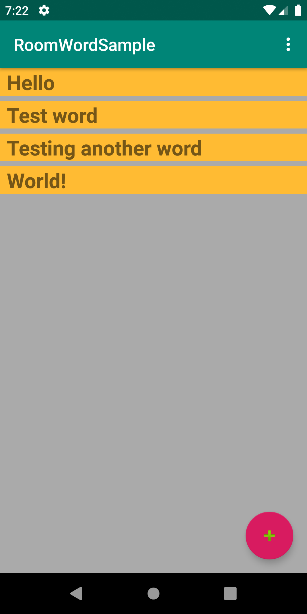
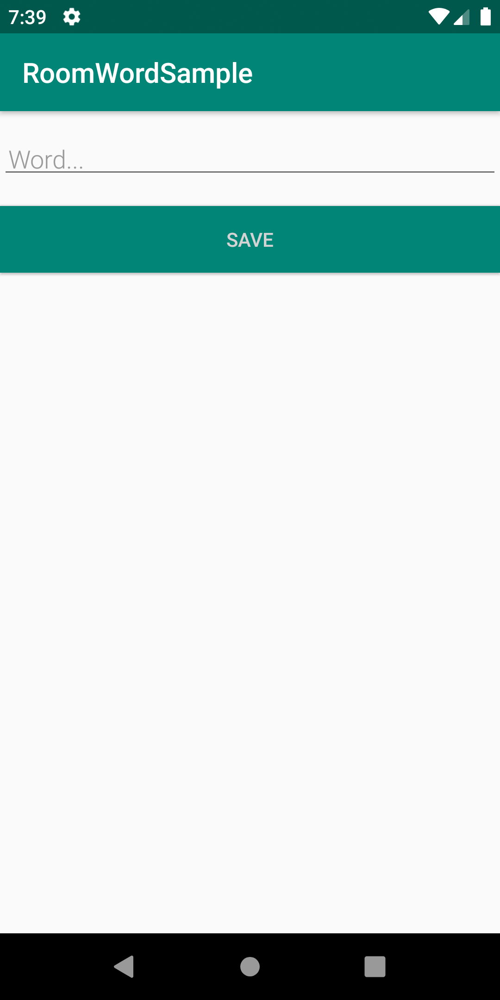

# Room-With-a-View
- A simple app displaying a list of words with a floating action button that gives the option to add more. 
- Designed using Android architecture components [LiveData](https://developer.android.com/topic/libraries/architecture/livedata), [ViewModel](https://developer.android.com/topic/libraries/architecture/viewmodel) and [Room Persistence Library](https://developer.android.com/topic/libraries/architecture/room).
- Created following the steps outlined at [Android Room with a View codelab](https://codelabs.developers.google.com/codelabs/android-room-with-a-view-kotlin/#0).

## Screenshots

